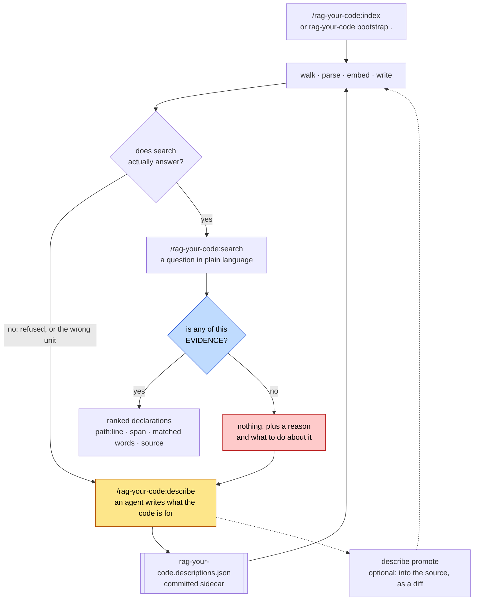
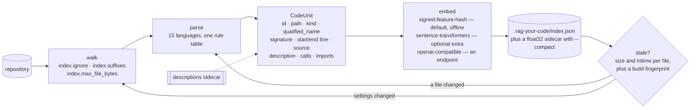
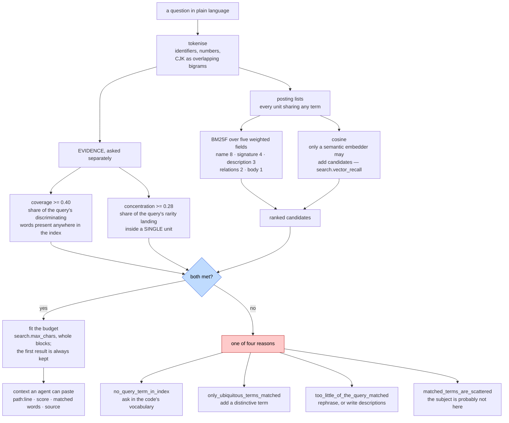
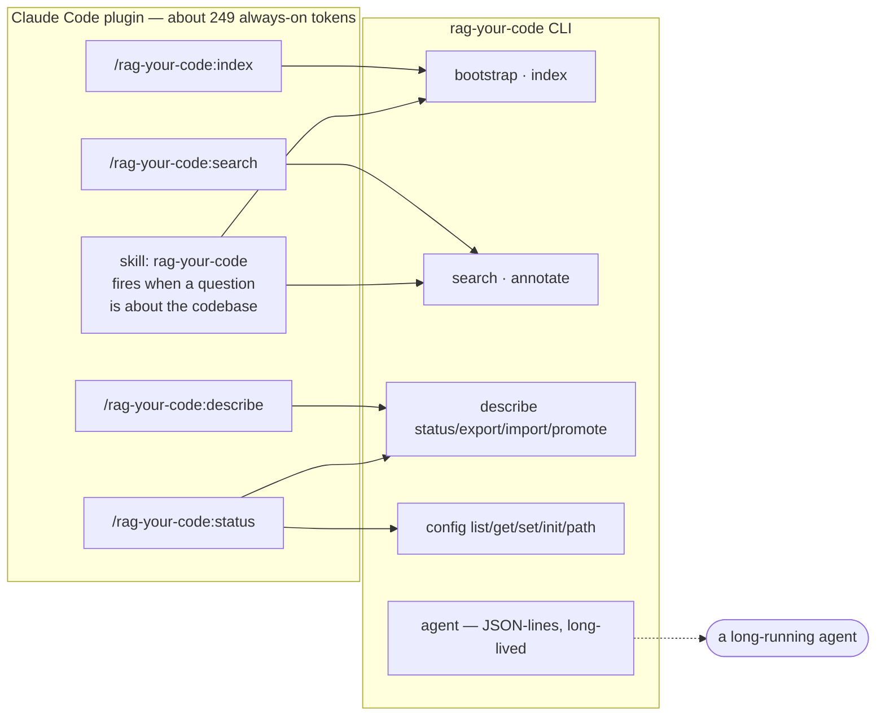

# How it runs, end to end

Four diagrams. The first is the loop a user or an agent actually lives in; the
rest open the three boxes inside it that are not obvious.

Every claim here is about code in this repository, not about a plan.

## 1 · The loop

The yellow box decides whether any of this is worth having, and nothing but a
model that has read the code can do it. Measured, it takes first-place accuracy
from 0.314 to 0.443 on this repository's own ruler.

The blue box is the one most retrieval does not have. It is why the red box
exists: an answer withheld with a reason beats a confident wrong one.

## 2 · Indexing

A unit's `description` is the field that carries vocabulary. Generated, it is
the identifier humanised, plus the signature, plus the author's docstring — so
it introduces **no word the source did not already contain**. That is the whole
reason the yellow box in diagram 1 exists.

The build fingerprint covers only the settings that change *what is indexed*.
Changing a result limit invalidates nothing; changing the vector width or the
suffix list invalidates everything, because an index built under those is not
stale — it is an index of something else.

## 3 · Answering, or not

Both bars are **ratios inside the query**, never thresholds on a score. A score
threshold is tied to whatever scale the ranking currently produces, and this
project has already had one stop meaning anything the moment BM25F changed the
scale.

A word counts as discriminating only while it stays under 5% of the corpus, and
that rule is derived from the corpus rather than from a stopword list — which
is what makes it work in a language nobody anticipated, and is also where it
degrades: across a large corpus of short undocumented methods, ordinary English
words fall under 5% and start counting as evidence.

Below 200 units both bars are eased in proportion. A ten-unit index cannot hold
the vocabulary of a sentence, and refusing its own questions would be worse
than answering them.

## 4 · The surfaces

The `agent` surface speaks nine actions over JSON lines: `search`, `research`,
`neighbors`, `open`, `bootstrap`, `describe_pending`, `describe_put`,
`refresh`, `stats`. One subprocess, JSON in and JSON out, for a session that
does not want to pay process startup per query.

No hooks, no MCP server, no background daemon. The commands are the
deterministic entry point; the skill is the path that fires without being
asked, and it exists because a model that has to remember a command will not
use one.

## Where the numbers behind this live

[README §6](../README.md#6--benchmark-dashboard) publishes every figure with the
fingerprint of the corpus it was taken on, and
[benchmarks/README.md](../benchmarks/README.md) lists the six commands that
produce them. Nothing in this document is a figure you cannot re-derive.
